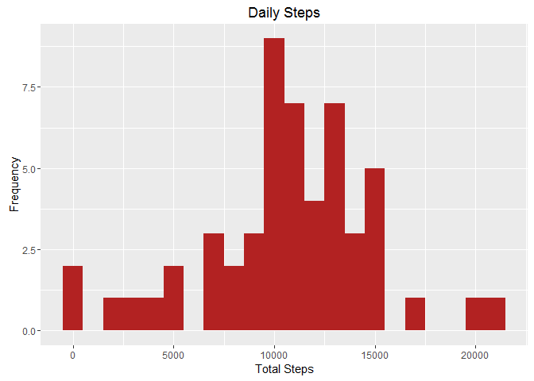
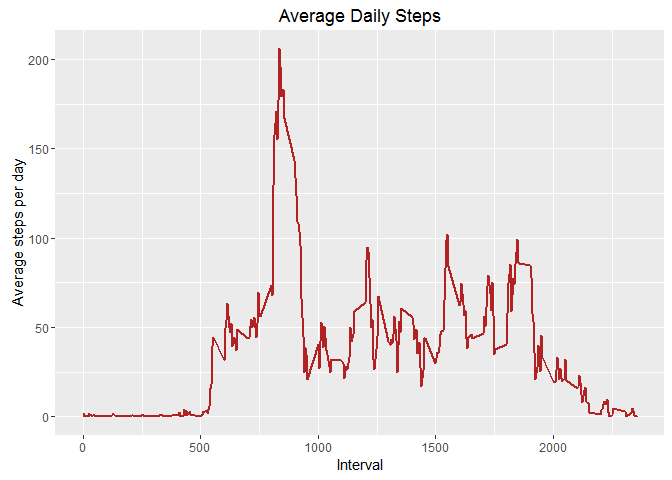
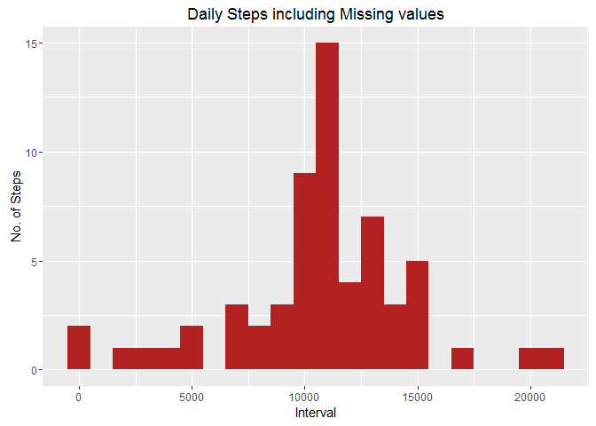
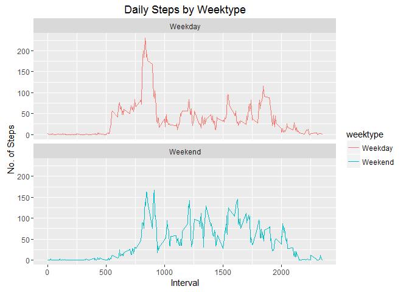

Reprodicible Research - Project 1
================

Introduction
------------

This assignment makes use of data from a personal activity monitoring device. This device collects data at 5 minute intervals through out the day. The data consists of two months of data from an anonymous individual collected during the months of October and November, 2012 and include the number of steps taken in 5 minute intervals each day.

The dataset can be downloaded from:

<https://d396qusza40orc.cloudfront.net/repdata%2Fdata%2Factivity.zip>

The variables included in this dataset are: . steps: Number of steps taking in a 5-minute interval (missing values are coded as NA) . date: The date on which the measurement was taken in YYYY-MM-DD format . interval: Identifier for the 5-minute interval in which measurement was taken The dataset is stored in a comma-separated-value (CSV) file and there are a total of 17,568 observations in this dataset.

Load and clean the data
-----------------------

From the above URL, the dataset "activity.csv" was loaded into the local working directory. We also need to the date field from convert chars to date format.

``` r
activitydata <- read.csv("activity.csv")
activitydata$date <- as.Date(activitydata$date)
```

What is mean total number of steps taken per day?
-------------------------------------------------

#### 1. Calculate total number of steps per day

``` r
Total_Steps <- activitydata %>%
  filter(!is.na(steps)) %>%
  group_by(date) %>%
  summarize(steps = sum(steps))
Total_Steps
```

    ## # A tibble: 53 × 2
    ##          date steps
    ##        <date> <int>
    ## 1  2012-10-02   126
    ## 2  2012-10-03 11352
    ## 3  2012-10-04 12116
    ## 4  2012-10-05 13294
    ## 5  2012-10-06 15420
    ## 6  2012-10-07 11015
    ## 7  2012-10-09 12811
    ## 8  2012-10-10  9900
    ## 9  2012-10-11 10304
    ## 10 2012-10-12 17382
    ## # ... with 43 more rows

##### 2. Plot a histogram of total steps per day:

``` r
library(ggplot2)

ggplot(Total_Steps, aes(x = steps)) +
        geom_histogram(fill = "firebrick", binwidth = 1000) +
        labs(title = "Daily Steps", x = "Total Steps", y = "Frequency")
```



##### 3. Calculate and report the mean and median of the total number of steps taken per day

##### Mean Steps:

``` r
Mean_Steps<- mean(Total_Steps$steps, na.rm=TRUE)
Mean_Steps
```

    ## [1] 10766.19

##### Median Steps:

``` r
Median_Steps<- median(Total_Steps$steps, na.rm=TRUE)
Median_Steps
```

    ## [1] 10765

### What is the average daily activity pattern?

#### 1. Make a time series line plot of the 5-minute interval and the average number of steps taken, averaged across all dates

##### Calculate intervals

``` r
Interval<- activitydata%>%
        group_by(interval)%>%
        filter(!is.na(steps))%>%
        summarise(avg_steps = mean(steps, na.rm=TRUE))
Interval
```

    ## # A tibble: 288 × 2
    ##    interval avg_steps
    ##       <int>     <dbl>
    ## 1         0 1.7169811
    ## 2         5 0.3396226
    ## 3        10 0.1320755
    ## 4        15 0.1509434
    ## 5        20 0.0754717
    ## 6        25 2.0943396
    ## 7        30 0.5283019
    ## 8        35 0.8679245
    ## 9        40 0.0000000
    ## 10       45 1.4716981
    ## # ... with 278 more rows

##### Plot average steps

``` r
ggplot(Interval, aes(x =interval , y=avg_steps)) +
        geom_line(color="firebrick", size=1) +
        labs(title = "Average Daily Steps",
             x = "Interval", 
             y = "Average steps per day")
```



### Imputing missing values

#### Calculate total number of missing values

``` r
sum(is.na(activitydata$steps))
```

    ## [1] 2304

#### Imputing missing values using mean for each day and create a new dataset with dataset missing values filled in

``` r
fullactivitydata <- activitydata
nas <- is.na(fullactivitydata$steps)
avg_interval<- tapply(fullactivitydata$steps,
                      fullactivitydata$interval, 
                      mean, 
                      na.rm=TRUE, 
                      simplify = TRUE)
fullactivitydata$steps[nas] <-
  avg_interval[as.character(fullactivitydata$interval[nas])]
names(fullactivitydata)
```

    ## [1] "steps"    "date"     "interval"

#### Create a histogram of total steps and calculate mean and median steps per day

##### Quick check of the data

``` r
Total_Steps_All<- fullactivitydata%>%
        group_by(date)%>%
        summarise(total_steps = sum(steps, na.rm=TRUE))
Total_Steps_All
```

    ## # A tibble: 61 × 2
    ##          date total_steps
    ##        <date>       <dbl>
    ## 1  2012-10-01    10766.19
    ## 2  2012-10-02      126.00
    ## 3  2012-10-03    11352.00
    ## 4  2012-10-04    12116.00
    ## 5  2012-10-05    13294.00
    ## 6  2012-10-06    15420.00
    ## 7  2012-10-07    11015.00
    ## 8  2012-10-08    10766.19
    ## 9  2012-10-09    12811.00
    ## 10 2012-10-10     9900.00
    ## # ... with 51 more rows

##### Plot the histogram

``` r
ggplot(Total_Steps_All, aes(x = total_steps)) +
        geom_histogram(fill = "firebrick", binwidth = 1000) +
        labs(title = "Daily Steps including Missing values",
             x = "Interval", 
             y = "No. of Steps")
```



##### Compare mean and median with original calculations from the raw dataset

``` r
Mean_Steps_All<- mean(Total_Steps_All$total_steps, na.rm=TRUE)
Mean_Steps_All
```

    ## [1] 10766.19

``` r
Median_Steps_All<- median(Total_Steps_All$total_steps, na.rm=TRUE)
Median_Steps_All
```

    ## [1] 10766.19

##### What is impact of imputing values? Ans: Because we used the Mean to impute, which is makes the new mean the same as the original. But it's not the same as the original median.

### Are there differences in activity patterns between weekdays and weekends?

``` r
head(fullactivitydata)
```

    ##       steps       date interval
    ## 1 1.7169811 2012-10-01        0
    ## 2 0.3396226 2012-10-01        5
    ## 3 0.1320755 2012-10-01       10
    ## 4 0.1509434 2012-10-01       15
    ## 5 0.0754717 2012-10-01       20
    ## 6 2.0943396 2012-10-01       25

``` r
str(fullactivitydata)
```

    ## 'data.frame':    17568 obs. of  3 variables:
    ##  $ steps   : num  1.717 0.3396 0.1321 0.1509 0.0755 ...
    ##  $ date    : Date, format: "2012-10-01" "2012-10-01" ...
    ##  $ interval: int  0 5 10 15 20 25 30 35 40 45 ...

##### Create new variable called to indicate weekday or weekend data:

``` r
fullactivitydata<- fullactivitydata%>%
        mutate(weektype= 
                 ifelse (weekdays(fullactivitydata$date)=="Saturday"|
        weekdays(fullactivitydata$date)=="Sunday",
                         "Weekend",
                         "Weekday"))

head(fullactivitydata)
```

    ##       steps       date interval weektype
    ## 1 1.7169811 2012-10-01        0  Weekday
    ## 2 0.3396226 2012-10-01        5  Weekday
    ## 3 0.1320755 2012-10-01       10  Weekday
    ## 4 0.1509434 2012-10-01       15  Weekday
    ## 5 0.0754717 2012-10-01       20  Weekday
    ## 6 2.0943396 2012-10-01       25  Weekday

##### Set up the new interval data

``` r
IntervalFull<- fullactivitydata%>%
        group_by(interval, weektype)%>%
        summarise(avg_steps2 = mean(steps, na.rm=TRUE))
head(IntervalFull)
```

    ## Source: local data frame [6 x 3]
    ## Groups: interval [3]
    ## 
    ##   interval weektype avg_steps2
    ##      <int>    <chr>      <dbl>
    ## 1        0  Weekday 2.25115304
    ## 2        0  Weekend 0.21462264
    ## 3        5  Weekday 0.44528302
    ## 4        5  Weekend 0.04245283
    ## 5       10  Weekday 0.17316562
    ## 6       10  Weekend 0.01650943

##### Plot the new interval data

``` r
plot<- ggplot(IntervalFull, aes(x =interval ,
                                y=avg_steps2,
                                color=weektype)) +
       geom_line() +
       labs(title = "Daily Steps by Weektype",
            x = "Interval",
            y = "No. of Steps") +
       facet_wrap(~weektype, ncol = 1, nrow=2)
print(plot)
```


